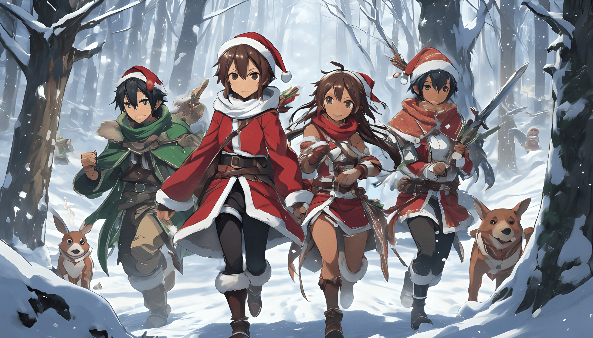

# Fim de Ano 2023

**Duração do Evento:** 26/12/2023 01:18 até 01/01/2024 23:59

**Detalhes do Bônus:**

* **150% de Bônus de XP e 100% em Moedas**: aplicáveis em aventuras, caçadas e ao completar missões;
* **Respawn Diário de Chefes de Andar**:
  * Segunda a Sexta: às 20h;
  * Sábado e Domingo: às 18h.

**Recompensas Diárias para Jogadores Ativos:**

* Todos os dias às 23:00, jogadores ativos nas últimas 24 horas receberão:
  * HP totalmente recuperado;
  * 1 Cristal de Teletransporte;
  * 10 Cash;
  * 2.500 Moedas;
  * 1 Poção HP Grande, 2 Médias e 3 Pequenas.

**Presentes Iniciais da Guild dos Aventureiros:**

* Apenas as contas que já estavam ativas no jogo no momento do início do evento receberam os seguintes presentes iniciais:
  * \+1 em cada atributo do personagem;
  * 1 ponto de habilidade;
  * HP totalmente recuperado;
  * 10 Cristais de Teletransporte;
  * 100 Cash;
  * 7.500 Moedas;
  * 10 Poções HP Grandes, 20 Médias e 30 Pequenas.

<figure><figcaption>
© 2023 Beater Studios. Todos os direitos reservados.
</figcaption></figure>
